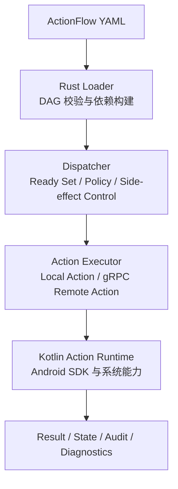
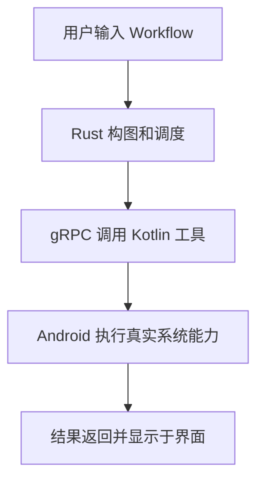
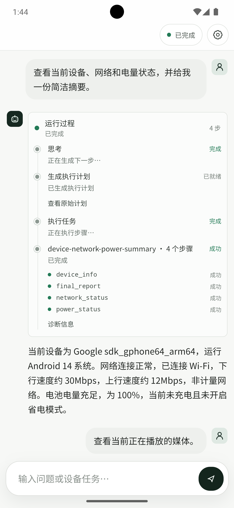
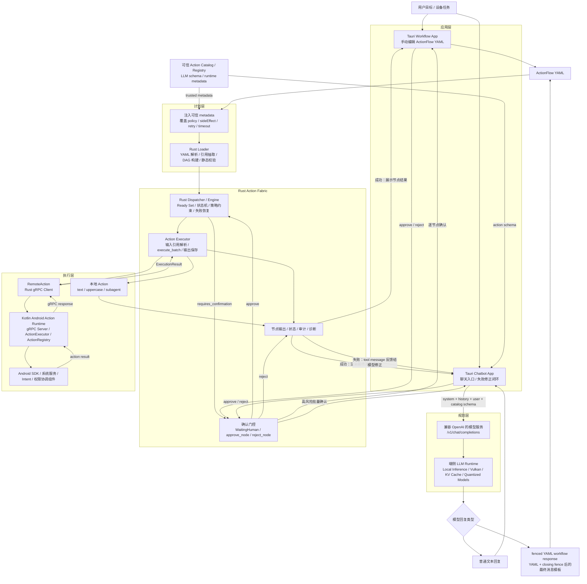

# OSH-26 Agent Runtime

本项目为中国科学技术大学 OSH-2026 课程大作业，面向 Android 端侧智能体构建一套可本地部署、可结构化执行、可观测且可扩展的 Agent Runtime。

项目围绕两个相互独立、平级协作的核心系统展开：

1. **Action Fabric**：负责将工具调用组织为显式 DAG，并在 Android 设备上完成调度、执行、状态管理、错误恢复与审计。
2. **端侧 LLM 推理框架**：负责在 Android 本地完成模型加载和推理，通过 Vulkan、KV Cache、量化等技术提升端侧推理效率。

两条技术线共同构成“本地模型负责规划与生成，Action Fabric 负责可靠执行”的端侧 Agent Runtime 技术栈。当前仓库包含 Action Fabric 的完整工程实现；端侧 LLM 推理框架位于独立仓库。

> 端侧 LLM 仓库：[项目仓库链接](https://github.com/SiriusPaul/agent-runtime-vllm-engine)

## 技术定位与核心竞争力

移动端 Agent 的主要瓶颈并不只是模型参数规模，而是端侧推理延迟、请求轮次、上下文长度、内存占用、功耗和系统权限之间的综合约束。传统 Agent Loop 将“模型思考、工具调用、观察结果、再次思考”串行化，每个工具结果都会重新触发一次模型决策。在云端大模型环境下，这种设计尚可依靠算力和网络吞吐缓解；但在 Android 端侧小模型、本地推理或弱网络环境中，多轮推理会快速放大端到端延迟，并引起上下文膨胀和功耗增加。

本项目的核心设计是将传统 Agent Loop 中隐式存在于自然语言上下文里的执行过程，显式提升为可校验、可调度、可审计的 Action DAG。模型负责一次性生成结构化 Workflow，Action Fabric 负责在 runtime 中解析依赖、计算 ready set、并发调度工具节点、保存中间状态、执行策略控制和错误恢复。成功路径不需要反复唤醒模型；只有 workflow 格式错误、节点失败、权限确认或异常恢复时，系统才将必要诊断反馈给模型进行修正。

这一设计带来以下系统级优势：

- **显著减少模型往返次数**：确定性后续动作由 DAG 依赖边表达，工具成功后由 runtime 自动触发下游节点，避免每一步都回到 LLM 重新决定下一步。
- **降低端到端延迟和尾延迟**：成功路径长度由图结构和工具耗时决定，减少模型推理带来的随机波动，使移动端交互响应更稳定。
- **天然支持并行调度**：互不依赖的工具节点可在同一 ready set 中并发执行，fan-out/fan-in 类任务的 wall-clock time 接近关键路径耗时，而不是所有步骤耗时之和。
- **控制上下文和 token 成本**：工具结果进入 runtime 状态存储，节点间通过 `${node}` 引用传递，模型不必反复读取完整历史和大体积 observation。
- **比非结构化零散工具调用更可控**：每个 Action 都有明确名称、类型化输入输出、依赖关系和执行策略，runtime 可以在执行前发现缺参、错参、未知工具和依赖不一致，而不是等模型在多轮自然语言交互中逐步暴露问题。
- **便于复现、测试和演进**：结构化 Workflow 可以作为稳定工件保存、回放、比较和 benchmark，工具 schema 与 action catalog 也能独立版本化；相比散落在对话历史中的临时工具调用，工程团队更容易做回归测试、能力扩展和故障定位。
- **比 heavy subagent 更轻量**：普通工具节点没有独立 prompt、history 和 todo list，只有输入、输出、依赖与策略；在确定性子任务中可以表达类似任务分解能力，但上下文和模型调用成本更低。
- **便于工程治理和安全控制**：Action metadata、风险等级、确认门控、重试预算、副作用等级和审计日志由可信 registry 与 dispatcher 统一管理，不依赖模型临场遵守自然语言约束。

## 项目成果

### Action Fabric：结构化 Agent 执行系统

Action Fabric 将传统 Agent Loop 中隐含于上下文的执行过程显式表示为 Action DAG。系统可以在执行前校验依赖关系，在运行时计算就绪节点集合，并对执行状态、错误恢复和副作用进行统一控制。

目前已经完成从 YAML Workflow 到 Android 实际工具调用的端到端链路：



#### Rust 调度内核

- 实现 ActionFlow YAML loader，根据 `${node}` 数据引用自动建立 DAG 依赖。
- 实现重复节点、缺失引用、自环与循环依赖检测。
- 实现节点状态机、前驱依赖检查、Ready Set 计算和拓扑调度。
- 支持无依赖节点的批量异步执行，并对非幂等 Action 施加串行约束。
- 建立 Action Policy，支持风险等级、确认门控、超时与重试策略。
- 实现有界恢复机制，根据重试预算和副作用等级执行 Retry，并将 Patch / Replan 作为诊断升级信号交给上层模型循环处理。
- 实现执行输出解析和节点间结果传递。
- 实现内存状态存储、审计日志和诊断上下文，能够完整记录节点状态迁移。
- 提供 Subagent Action 与 Dispatcher Tool Executor，已用于 SubagentAction 和 Chatbot 后端执行模型生成的 Workflow。

#### Rust-Kotlin 跨语言执行链

- 定义统一的 Action 输入、输出、错误和注册表抽象。
- 完成基于 Protocol Buffers 与 gRPC 的 Rust-Kotlin 通信协议。
- Rust `RemoteAction` 可将任意注册的工具节点转发至 Kotlin Runtime。
- Kotlin 侧通过 `ActionExecutor + JsonCodec + ActionRegistry` 完成类型化输入解码、执行和结果编码。
- 网络层使用 Rustls，已完成 Android `aarch64-linux-android` 交叉编译与链接验证。

#### Android Action Runtime

Kotlin Runtime 已实现并注册 **59 个 Android Action**，覆盖设备状态、应用管理、网络、文件、媒体、联系人、短信、日历、通知、相机、录音、屏幕捕获和 Intent 等能力。

代表性 Action 包括：

| 能力类别 | 已实现 Action 示例 |
| --- | --- |
| 设备与系统 | `device_info`、`system_info`、`power_status`、`storage_info` |
| 网络与连接 | `network_status`、`http_call`、`wifi_toggle`、`bluetooth_toggle` |
| 应用与 Intent | `list_installed_apps`、`launch_app`、`intent_show_map`、`intent_compose_email` |
| 数据与文件 | `read_file`、`search_files`、`clipboard_read`、`clipboard_copy` |
| 个人信息 | `search_contacts`、`read_sms`、`list_calendar_events` |
| 媒体与传感 | `take_photo`、`record_audio`、`screenshot`、`screen_record` |
| 系统交互 | `set_alarm`、`set_timer`、`list_notifications`、`media_play_pause` |

Android Runtime 以前台服务形式运行 gRPC Server，并配套实现权限申请、Intent Host、MediaProjection 协调、通知监听和执行审计。仓库内的原生 Android Smoke Test App 可直接在模拟器或真机上逐项验证工具能力。

#### Tauri Workflow Android App

项目提供了面向最终演示的 Tauri 2 Android 应用：

- 在移动端界面直接编辑 ActionFlow YAML。
- 自动解析 DAG 并由 Rust Dispatcher 调度。
- 本地支持 `text`、`uppercase`、`subagent`，其余 action 通过可配置的 gRPC endpoint 调用同机或局域网内的 Kotlin Action Runtime。
- 展示各节点执行状态、输出结果、审计轨迹和诊断信息。
- 已完成 TypeScript 构建、Rust 单元测试、Android 原生工程生成和 ARM64 Debug APK 构建。

该应用验证了如下完整场景：



#### Tauri Chatbot Android App

在 Workflow App 之外，项目进一步实现了 `examples/tauri-chatbot-android`，作为最终形态的 Android Agent 应用原型。该应用将模型对话、Workflow 生成、DAG 执行和结果渲染整合在同一交互入口中：

- 用户以自然语言发起任务，后端向兼容 OpenAI `/v1/chat/completions` 的端侧模型服务发送系统提示词和可信 action catalog。
- 模型可以直接返回普通文本，也可以返回以 fenced YAML 开头的 workflow response。
- 当回复以 Workflow 开头时，Rust 后端抽取 ActionFlow YAML，调用 `rust/dispatcher` 完成校验、构图、调度与执行。
- Workflow 成功时，系统直接渲染 closing fence 后的最终消息模板，不再调用模型进行二次审查或总结。
- Workflow 失败、用户拒绝或节点异常时，系统将节点状态、已执行结果和诊断信息作为 tool message 反馈给模型，进入有限轮次修正。
- 需要确认或高风险的节点在执行前由 Chatbot App 聚合为批量确认；可信 action metadata 不暴露给模型，避免模型自行伪造策略字段。

该应用展示了“模型生成结构化计划、Action Fabric 可靠执行、成功路径自动推进、异常路径有限回退模型”的完整 Agent Loop 改造方案，是项目面向最终用户的主要演示入口。

实机运行截图如下，展示了 Chatbot App 生成并执行设备、网络和电量状态查询 Workflow 后的结果：

<p align="center">
  
</p>

### 端侧 LLM：Android 本地推理框架

端侧 LLM 技术线已完成面向 Android 的本地大语言模型推理系统。完整端侧 LLM 工程位于独立仓库，本仓库保留相关实验资料、脚本、接口对接验证和成果说明。系统基于 `llama.cpp` 与 GGUF 模型格式，重写了计算后端与 KV Cache 机制，建立了模型加载、推理执行、结果采样和接口调用的完整链路，并已适配 Android Studio、Android 模拟器及 Android 真机。

系统支持 Qwen3-0.6B, Qwen3-1.7B 等小规模语言模型在移动端完全本地运行，同时提供兼容 OpenAI API 的调用接口，可供上层应用或 Agent 系统直接接入。

#### GPU 推理与长上下文优化

- 引入 Vulkan Runtime 和 Compute Shader，将矩阵乘法、Attention、Prefill 和 LM Head 等关键计算迁移至 GPU。
- 通过并行化矩阵乘法、合并显存提交和优化 LM Head 流程，提高推理吞吐并降低首 Token 延迟。
- 实现 Chunked Prefill，将长 Prompt 分块处理，降低峰值内存压力并改善 GPU 利用率。
- 支持 8K 上下文窗口，可处理较长对话和复杂输入。

#### KV Cache 与前缀复用

- 实现完整 KV Cache，使 Decode 阶段复用历史 Key/Value，避免重复计算上下文。
- 引入 LRU Cache Block 管理，对缓存块进行动态复用和淘汰。
- 实现仅前缀匹配的 Prefix KV Cache，相同前缀请求可直接复用已有缓存。
- 显著减少重复 Prefill 开销，为连续对话和多请求场景提供高效缓存基础。

#### 量化与移动端资源优化

- 实现原生 Q8_0 量化模型支持。
- 将 Decode 阶段接入 Q8_0 量化推理路径。
- 降低模型存储占用和内存带宽压力，提高移动设备上的推理效率。
- 建立量化正确性验证流程，为后续扩展 Q4 等更低比特量化方案奠定基础。

该技术线已经形成覆盖 Android 部署、Vulkan GPU 加速、KV Cache 管理、前缀缓存复用、长上下文和量化推理的一体化端侧推理框架。

## 系统协作关系

两条技术线通过稳定接口实现解耦：



端侧模型可以负责意图理解、任务拆解和 Workflow 生成；Action Fabric 接收结构化计划后执行静态校验、并发调度、策略控制和工具调用。该分工避免让语言模型直接承担底层执行控制，使推理与执行能够独立优化、测试和演进。

## 性能评测

为验证 Action DAG 相比传统 Agent Loop 和 heavy subagent 的系统优势，项目新增本地可复现 benchmark：

- Runner：`rust/dispatcher/examples/action_graph_benchmark.rs`
- 原始结果：`rust/dispatcher/benchmark_results/action_graph_vs_loop/raw.csv`
- 汇总结果：`rust/dispatcher/benchmark_results/action_graph_vs_loop/summary.csv`
- 分析报告：`rust/dispatcher/benchmark_results/action_graph_vs_loop/analysis.md`

评测覆盖确定性流水线、fan-out/fan-in 并行、上下文压力、失败恢复和多子任务分解五类工作负载。Action Graph 路径复用项目真实 `dispatcher::Engine`、ready set 调度和 `ActionExecutor::execute_batch`；对照组包括完整 observation Agent Loop、压缩 observation Agent Loop 和 heavy subagent。每组配置重复 3 次，统计端到端延迟、p95 延迟、模型调用次数、工具调用次数、累计上下文输入量、单轮最大上下文、runtime 存储输出大小和最大并发宽度。

### 关键结果

| 场景 | Action Graph | 对照方案 | 主要结论 |
| --- | ---: | ---: | --- |
| 12 步确定性流水线 | 433.4 ms | Agent Loop 3760.8 ms | 延迟降低 **88.5%**，模型调用从 12 次降至 1 次 |
| 16 路 fan-out/fan-in | 327.7 ms | Agent Loop 5316.6 ms | 最大并发宽度从 1 提升至 16，wall-clock time 接近关键路径 |
| 5 步、每步 1MB 输出 | 5.7 KB prompt | Loop full 10266.1 KB prompt | 大体积工具结果不反复进入模型上下文，显著降低 context 压力 |
| 20% transient failure | 410.5 ms | Agent Loop 3135.6 ms | 存在失败和重试时，成功节点仍由 runtime 推进 |
| 5 个子任务 × 3 步 | 347.5 ms | Heavy subagent 1548.0 ms | 模型调用从 17 次降至 1 次，上下文输入量减少 **92.4%** |

### 结果分析

在确定性多步任务中，Agent Loop 的成本随步骤数线性增长，因为每个工具结果都需要重新进入模型决策。Action Graph 将成功路径上的后续动作编码为依赖边，12 步流水线中模型调用次数稳定为 1 次，使端到端延迟从 3760.8 ms 降至 433.4 ms。

在 fan-out/fan-in 场景中，Action Graph 能直接表达独立节点集合，并由 dispatcher 在同一 ready set 中批量异步执行。16 路 fan-out 的最大并发宽度达到 16，而传统 loop 对照组最大并发宽度为 1，说明 DAG 表示不仅减少模型调用，也释放了 runtime 层面的并行执行能力。

在上下文压力场景中，完整 observation loop 会将大体积工具输出持续带入后续模型输入，5 步、每步 1MB 输出时累计 prompt 规模达到 10266.1 KB。即使采用 compact observation，Agent Loop 仍需要 5 次模型调用，累计模型输入约 46.1 KB；Action Graph 只需在规划阶段输入约 5.7 KB，其余中间结果由 runtime 状态保存和传递。

在 heavy subagent 对比中，subagent 能提供任务拆分能力，但每个子任务都需要独立 prompt、上下文和多轮循环。对于确定性子任务，Action Graph 用普通工具节点表达同样依赖结构，避免为每个子任务启动完整 agent loop。在 5 个子任务、每个 3 步的任务分解中，Action Graph 平均 347.5 ms，heavy subagent 平均 1548.0 ms，模型调用次数从 17 次降至 1 次。

这些结果说明，Action Graph 的价值不是单纯“结构更清晰”，而是直接转化为低延迟、低上下文压力、低模型调用次数、更强并行能力和更稳定成功路径的系统收益。对于移动端 Agent，这些指标对应有限算力、有限内存、低功耗和短交互等待时间等核心约束。

## 仓库结构

```text
agent_runtime/
├── docs/
│   └── action_fabric/              # 调研、可行性与 Android 技术文档
├── examples/
│   ├── android-action-runtime/     # Kotlin Runtime 真机冒烟测试应用
│   ├── dispatcher_demo/            # 早期 Rust DAG 调度示例
│   ├── tauri-workflow-android/     # Workflow 编辑与执行 Android App
│   └── tauri-chatbot-android/      # 可循环执行 Workflow 的 Chatbot Android App
├── kotlin/
│   └── kotlin-actions-runtime/     # Android Action Runtime 核心库
├── rust/
│   ├── actions/                    # Action 抽象、gRPC 与远程执行桥
│   └── dispatcher/                 # DAG 调度、状态、策略、恢复与 benchmark
│       ├── examples/
│       │   └── action_graph_benchmark.rs
│       └── benchmark_results/
│           └── action_graph_vs_loop/
├── LICENSE
└── README.md
```

## 运行与验证

### Rust Dispatcher

```bash
cd rust/dispatcher
cargo test
```

### Rust Actions 编译检查

```bash
cd rust/actions
cargo check
```

### Action Graph Benchmark

```bash
cd rust/dispatcher
cargo run --example action_graph_benchmark -- --iterations 3
```

运行后会更新：

```text
benchmark_results/action_graph_vs_loop/raw.csv
benchmark_results/action_graph_vs_loop/summary.csv
benchmark_results/action_graph_vs_loop/analysis.md
```

### Android Action Runtime

使用 Android Studio 打开 `examples/android-action-runtime`，安装应用并启动 gRPC Service。服务默认监听 `8080` 端口。

也可以直接构建 Debug APK：

```bash
cd examples/android-action-runtime
./gradlew :app:assembleDebug
```

输出路径：

```text
examples/android-action-runtime/app/build/outputs/apk/debug/app-debug.apk
```

### Tauri Workflow App

```bash
cd examples/tauri-workflow-android
yarn
yarn tauri android init
yarn tauri android dev
```

桌面验证：

```bash
yarn tauri dev
```

当 Kotlin Runtime 与 Tauri App 位于同一台 Android 设备时，gRPC endpoint 使用：

```text
127.0.0.1:8080
```

### Tauri Chatbot App

```bash
cd examples/tauri-chatbot-android
yarn
yarn tauri dev
```

Android：

```bash
yarn tauri android dev
```

## 当前完成度

| 模块 | 完成情况 |
| --- | --- |
| ActionFlow YAML 与 DAG 构建 | 已完成 |
| DAG 校验、Ready Set 与并发调度 | 已完成 |
| 状态机、策略、恢复和审计 | 已完成 |
| Rust-Kotlin gRPC 执行桥 | 已完成 |
| Android Action Runtime 与 59 个 Action | 已完成 |
| Android Smoke Test App | 已完成 |
| Tauri Workflow Android App | 已完成并产出 ARM64 APK |
| Tauri Chatbot Android App | 已完成，可循环执行 Workflow 并展示失败修正 |
| Action Graph vs Agent Loop benchmark | 已完成，包含原始数据、汇总表和分析报告 |
| Android 端侧 LLM 基础推理链（独立仓库） | 已完成，本仓库保留实验资料与接口对接说明 |
| Vulkan GPU 推理优化（独立仓库） | 已完成 |
| KV Cache、Prefix Cache 与 8K 上下文（独立仓库） | 已完成 |
| Q8_0 量化推理（独立仓库） | 已完成 |
| Action Fabric 与端侧 LLM 的产品级整合 | 已完成 OpenAI-compatible 接口对接验证，Chatbot App 可接入端侧模型服务生成并执行 Workflow |

## 会议记录

以下记录概括项目从方向选择、技术收敛到工程交付的主要阶段。

| 次序 | 日期 | 主题与阶段结论 |
| --- | --- | --- |
| 1 | 2026-03-09 | 完成团队组建与课程目标对齐，确定以“移动端系统能力与智能体结合”为初始探索方向。 |
| 2 | 2026-03-16 | 明确项目总体叙事为 Agent Runtime，重点研究模型之外的任务执行、工具调用和系统编排能力。 |
| 3 | 2026-03-25 | 根据指导意见收敛至 Android 端侧部署与可复现执行路径，确立以公开 Android API 和可真机验收为工程边界。 |
| 4 | 2026-04-10 | 建立双线并行架构：端侧 LLM 组负责本地推理、缓存与性能优化；Action Fabric 组负责结构化工具抽象、调度和 Android 执行。 |
| 5 | 2026-04-15 | 确定以 Action DAG 替代隐式 Agent Loop 执行路径，采用 Rust Dispatcher、Kotlin Runtime 和跨语言 RPC 的总体方案。 |
| 6 | 2026-05-06 | 完成 Dispatcher 基础闭环、ActionFlow YAML loader、恢复机制和本地调度示例；Android Runtime 与首版工具能力进入可运行状态。 |
| 7 | 2026-05-18 | 完成 Android Intent Action、后台 Action、权限协调、执行审计及 Smoke Test UI，形成模拟器与真机验证流程。 |
| 8 | 2026-05-25 | 完成 Action Policy、风险等级和 Rust gRPC Client，明确工具副作用、确认门控与远程执行策略。 |
| 9 | 2026-06-03 | 打通 Rust-Kotlin gRPC Remote Action、节点输入引用解析和 Subagent 执行接口，Action Fabric 形成端到端执行链。 |
| 10 | 2026-06-07 | 端侧 LLM 技术线完成 KV Cache、GPU 推理、量化和性能测试阶段成果整理，双线核心功能均达到展示要求。 |
| 11 | 2026-06-10 | 完成 Tauri Workflow Android App、真实 Kotlin 工具节点转发与 ARM64 APK 构建，形成可交互的最终演示入口。 |
| 12 | 2026-06-29 | 完成 Action Chat Android 应用、Action Graph vs Agent Loop benchmark、性能结果汇总和最终展示文档整理。 |

## 后续工作

项目核心技术链路、移动端执行入口、端侧模型对接和性能评测已经完成。后续工作主要集中在补充文件化 Trace Store、增加字段级输出引用与局部数据投影、扩展更多 Android 系统能力，并完善端侧模型自动生成 Workflow 后的长任务联合评测。

## 许可证

本项目采用 [MIT License](LICENSE)。
