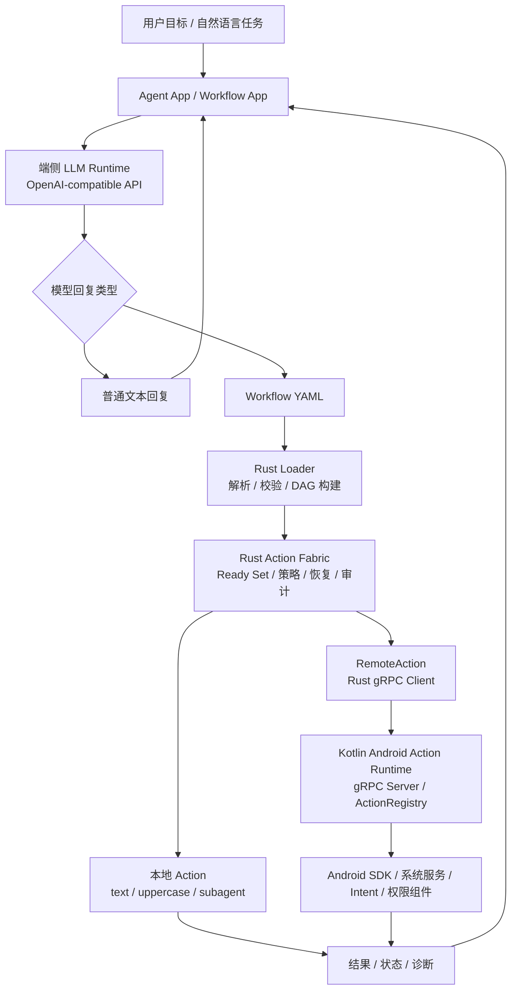
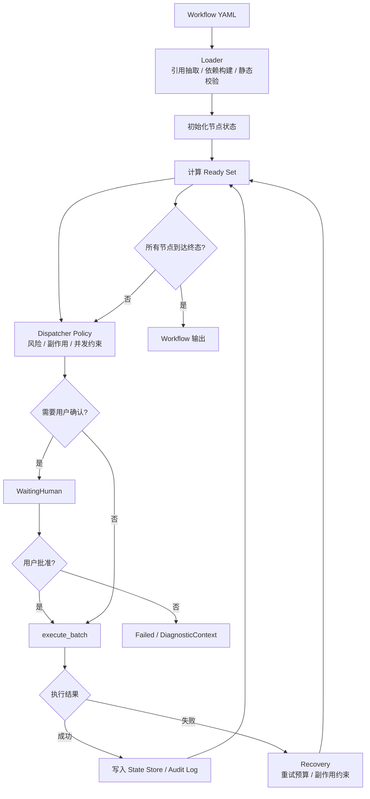
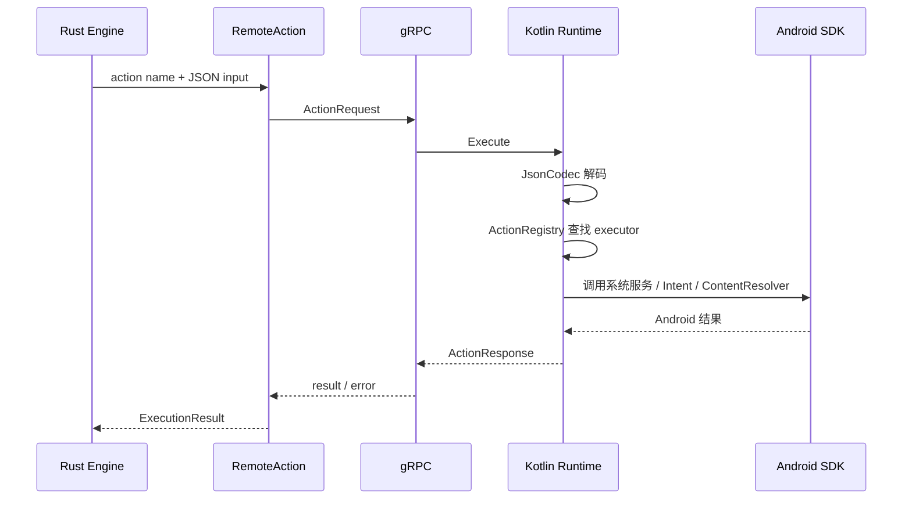
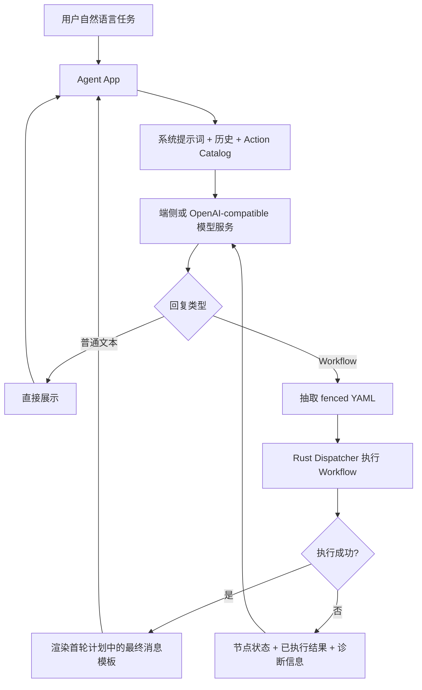
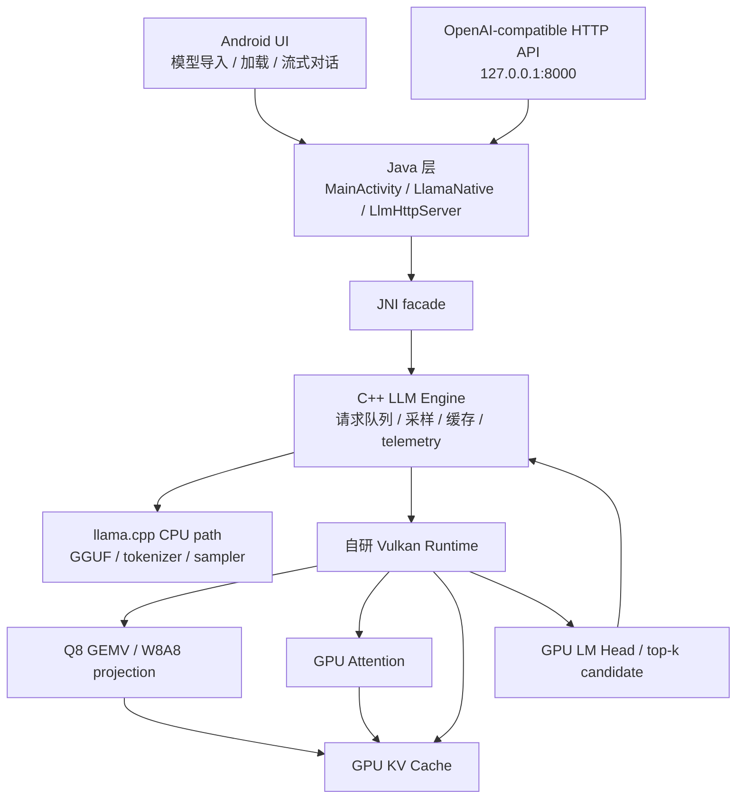
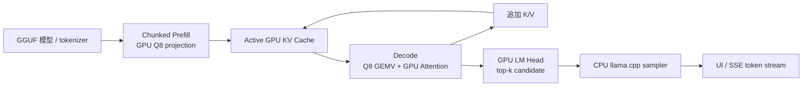

# Agent Runtime：结题报告

## 1. 摘要

Agent Runtime 是中国科学技术大学 OSH-2026 课程大作业项目，面向 Android 端侧智能体构建一套可本地部署、可结构化执行、可观测且可扩展的运行时系统。项目的核心目标不是单独实现一个模型或一个工具集合，而是把端侧模型推理、任务规划、结构化执行、Android 系统能力调用、安全策略和运行时审计连接成完整链路，使移动端智能体能够在资源受限、权限严格和交互延迟敏感的环境中稳定工作。

项目由两条平级技术线协同组成。第一条是 Action Fabric 结构化执行系统，负责把模型生成的任务计划表示为显式 Workflow DAG，并在 Android 设备上完成依赖校验、ready set 调度、并发执行、状态管理、错误恢复、权限确认和审计记录。第二条是端侧 LLM 推理框架，负责在 Android 本地完成模型加载与推理，通过 Vulkan、KV Cache、Prefix Cache、Q8_0 量化、请求队列和 telemetry 等技术提升端侧推理效率，并对上层提供兼容 OpenAI 的模型服务接口。

两条技术线共同形成“本地模型负责规划与生成，Action Fabric 负责可靠执行”的端侧 Agent Runtime 技术栈。最终项目已经完成从自然语言任务到 Workflow 生成、Rust 调度、Rust-Kotlin gRPC 转发、Kotlin Android Action Runtime 执行真实系统能力、Agent App 展示结果和异常诊断回路的端到端验证。仓库中包含 Action Fabric 的完整工程实现、Android Action Runtime、Workflow App、Agent App、性能 benchmark、最终汇报材料以及端侧 LLM 技术线的接口对接说明；端侧 LLM 完整工程位于独立仓库 [SiriusPaul/agent-runtime-vllm-engine](https://github.com/SiriusPaul/agent-runtime-vllm-engine)。

从系统效果看，Action Fabric 将传统 Agent Loop 中隐含在自然语言上下文里的执行过程提升为可校验、可调度、可审计的 Workflow DAG。模型只需要在成功路径上生成一次结构化计划，后续确定性动作由运行时根据依赖关系自动推进，只有格式错误、节点失败、用户拒绝或异常恢复时才有限回退给模型。Benchmark 显示，在 12 步确定性流水线中，Action Graph 路径将平均延迟从传统 Agent Loop 的 3760.8 ms 降至 433.4 ms，模型调用从 12 次降至 1 次；在 16 路 fan-out/fan-in 场景中，最大并发宽度从 1 提升至 16。端侧 LLM 技术线则在红米 K40 真机上验证了 Qwen3-0.6B 与 Qwen3-1.7B 的本地推理优化效果，其中 pinned prefix 命中场景下 TTFT 分别降低 77.7% 和 78.1%。

因此，本项目的主要成果是一个面向移动端智能体的系统级原型：它既解决模型在端侧规划和推理时的性能问题，也解决模型生成计划之后如何可靠落地到 Android 系统能力的问题。

## 2. 小组成员以及分工

本项目按两条技术线组织开发。Action Fabric 方向由张贺淇负责，成员包括杨家越、贺秋实；端侧 LLM 部署与优化方向由陈雨桥负责，成员包括周子墨。

两条技术线在最终阶段进行联合联调：端侧 LLM 推理框架为 Agent App 提供 OpenAI-compatible 模型服务接口，Action Fabric 围绕该接口完成 Workflow 生成协议、Action Catalog、结构化执行和失败诊断闭环。

## 3. 立项依据

### 3.1 研究背景

随着大语言模型从云端问答工具逐步演进为能够调用外部工具、执行多步任务的智能体系统，移动端智能体成为一个具有现实需求的方向。手机掌握大量个人上下文和系统能力，例如联系人、日历、通知、文件、相机、录音、地图、应用启动和网络状态等；如果智能体能够在本地理解用户意图，并安全调用这些能力，就可以形成比传统语音助手或自动化脚本更灵活的移动端任务执行系统。

但是，移动端 Agent 的主要瓶颈并不只是模型参数规模。Android 端侧运行环境同时受到本地推理延迟、弱网络或离线场景、上下文窗口、内存占用、功耗、温控、后台执行限制、系统权限和用户确认流程的约束。传统 Agent Loop 通常采用“模型思考、调用工具、观察结果、再次思考”的串行范式。每个工具结果都会重新进入模型上下文，并触发一次新的模型决策。在云端大模型环境下，这一机制可以通过算力和网络吞吐部分缓解；但在端侧小模型、本地推理或弱网络环境中，多轮推理会快速放大端到端延迟，并带来上下文膨胀和功耗增加。

另一方面，Android 系统能力天然具有副作用和权限边界。读取设备状态、查询联系人、拉起 Intent、发送短信、创建日历事件、录音、截图等能力都需要明确的输入、输出、权限和审计记录。如果把这些能力直接暴露给模型，并依赖自然语言提示词约束模型行为，系统很难在执行前发现错参、缺参、未知工具、循环依赖和高风险动作，也难以在失败后控制重试和副作用。因此，端侧 Agent 需要的不只是一个会调用工具的模型，而是一个可靠的执行系统。

### 3.2 业界现状与设计启发

围绕 Agent 执行瓶颈，业界方案正在从“让模型看到更多上下文”转向“让模型看到更短、更可信、更结构化的信息”，并把工具调用与执行过程系统化。

MCP 和 Tool Calling 类方案强调工具名称、schema、资源链接和元数据的标准化，使模型能够以较稳定的方式连接外部能力。这类工作说明工具接口需要有清晰边界：模型可以选择能力和填写参数，但具体权限、风险、超时、重试和执行策略应该由可信系统管理，而不能由模型临场自述。

Context engineering / context management 方向强调对上下文进行写入、选择、压缩和隔离。对于移动端 Agent，这一点尤为关键。工具结果不应无差别进入后续 prompt；大体积 observation、固定系统提示词、工具协议和重复历史都应该被运行时结构化保存和引用，而不是反复消耗模型上下文。

Workflow patterns 则说明很多智能体任务并不需要每一步都回到模型重新决策。对于 prompt chaining、routing、parallelization、orchestrator-workers 等模式，确定性执行路径可以沉淀为 Workflow，由系统负责调度，模型只处理开放性规划、异常修正和最终表达。

从调度理论角度看，传统 Agent Loop 可以理解为一种 single-ready-unit scheduler：任意时刻最多只有一个任务被模型选中执行，依赖关系和控制流隐藏在上下文里。相比之下，DAG 调度能显式表达多个可执行节点、依赖边、并行 ready set 和失败路径。这为本项目采用 Workflow DAG 替代隐式 Agent Loop 提供了理论启发。

端侧 LLM 技术线则受到 llama.cpp、GGUF 模型生态、vLLM / PagedAttention、量化推理和移动 GPU compute shader 等工作的启发。项目没有重写模型生态，而是复用 GGUF、tokenizer 和 sampler 等成熟资产，同时重写 Android 侧系统边界，包括 Vulkan 后端、KV / Prefix Cache、请求队列、模型生命周期和 telemetry。

### 3.3 核心技术挑战

本项目的核心挑战主要来自执行系统和端侧推理两侧。

第一，传统 Agent Loop 的执行路径隐含在自然语言上下文中，缺少可计算结构。系统无法在执行前静态检查依赖、循环、缺参和未知工具，也无法根据图结构自动并发执行独立节点。因此，需要设计一种模型可生成、运行时可验证、Android 能落地的 Workflow 表示。

第二，Android 系统能力复杂且副作用差异明显。设备状态查询、文件读取、网络请求、Intent 跳转、短信、联系人、日历、相机、录音、屏幕捕获和通知监听分别涉及不同系统服务、权限模型和生命周期。项目需要把这些能力统一封装为类型化 Action，并提供稳定的注册表和执行协议。

第三，Rust 调度层和 Kotlin Android 能力层需要跨语言协作。Rust 更适合实现调度内核、状态机和恢复机制，Kotlin 更适合访问 Android SDK 和系统组件。两侧之间需要稳定序列化协议、错误模型和异步执行链路，否则 Action 扩展会与调度器强耦合。

第四，执行治理不能依赖模型自律。风险等级、副作用等级、用户确认、超时、重试预算、是否允许 subagent 调用等策略必须来自可信 registry metadata。模型生成的 Workflow 只能描述任务结构和参数，不能伪造策略字段。

第五，端侧 LLM 推理必须在移动设备资源限制下持续可用。Android 上直接使用原版 GPU 后端会遇到 OpenCL 部署边界、Vulkan 版本和驱动语义不稳定等问题。项目需要在保留 llama.cpp / GGUF 生态的基础上，建立可控的 Vulkan 1.1 kernel、KV Cache、Prefix Cache、Q8_0 数据通路和请求调度机制。

### 3.4 创新点

本项目的创新点首先在于将 Agent 执行从“推理驱动”转向“调度驱动”。模型不再在每个工具成功后被唤醒来决定下一步，而是在初始阶段生成完整 Workflow；运行时负责解析依赖、计算 ready set、并发调度、保存状态和处理恢复。这一设计使成功路径上的模型调用次数稳定降低，且执行过程可以被测试、回放和审计。

其次，Action Fabric 将 Android 工具能力提升为统一的结构化 Action。每个 Action 具备明确名称、类型化输入输出、风险等级、副作用等级、确认策略、超时和重试预算。系统可以在执行前发现结构错误，在执行中控制风险，在执行后保留审计轨迹。

第三，项目实现了 Rust-Kotlin gRPC 跨语言执行链。Rust 侧的 RemoteAction 可以把任意注册工具节点转发到 Kotlin Runtime，Kotlin 侧通过 ActionExecutor、JsonCodec 和 ActionRegistry 完成输入解码、真实 Android 能力执行和结果编码。这使调度内核与 Android 能力层解耦，后续扩展 Action 不需要重写调度器。

第四，端侧 LLM 技术线针对 Agent workload 做了专门优化。普通聊天和 stateless subagent 使用不同 cache key；固定工具协议和 subagent 协议进入 pinned prefix；请求调度采用 prefix-aware-aging-v2，在利用缓存命中的同时避免 cache miss 请求饥饿。相比单纯把模型跑在手机上，这一方向更关注模型作为 Agent 系统服务时的可复用性、可取消性、可观测性和长期运行稳定性。

最后，项目不是停留在架构图层面，而是形成了可交互的 Android Agent App。用户可以以自然语言发起任务，模型生成 Workflow，Dispatcher 执行真实 Android Action，成功后在界面渲染结果，失败时返回结构化诊断进入有限修正。这验证了端侧模型和结构化执行系统合流的可行性。

## 4. 项目设计

### 4.1 总体架构

Agent Runtime 的总体架构可以分为应用层、规划层、计划层、执行层和 Android 能力层。



应用层包括 Workflow App 和 Agent App。Workflow App 面向手工编辑与调试，可以直接输入 Workflow YAML，观察 DAG 校验、节点状态、输出结果、审计轨迹和诊断信息。Agent App 面向最终用户，以自然语言对话作为入口，负责调用模型服务、注入 Action Catalog、识别模型回复类型、抽取 Workflow、触发 Dispatcher 执行并展示最终结果。

规划层由兼容 OpenAI `/v1/chat/completions` 的模型服务和端侧 LLM Runtime 组成。模型接收用户目标、对话历史、系统提示词和 Action Catalog schema，输出普通文本或 fenced YAML workflow response。端侧 LLM Runtime 则负责本地模型加载、推理、缓存复用、请求调度和健康状态上报。

计划层由可信 Action Catalog / Registry、metadata 注入和 Rust Loader 组成。模型看到的是工具 schema，用于生成合法 Workflow；可信 registry metadata 不暴露给模型，而是在运行时覆盖或补充 policy、sideEffect、retryBudget、timeoutMs 等策略字段。Loader 负责解析 Workflow YAML、抽取 `${node}` 引用、建立依赖边并执行静态校验。

执行层是 Rust Action Fabric。其核心包括 Dispatcher / Engine、确认门控、Action Executor、状态存储、审计日志和诊断上下文。Engine 不询问模型“下一步是什么”，而是根据 DAG 和节点状态推进执行。当多个节点同时满足依赖时，Dispatcher 将其放入同一 ready set 并批量异步执行；当节点需要用户确认时，系统进入 WaitingHuman；当节点失败时，Recovery 根据副作用等级和重试预算决定自动重试、终止或向上层模型反馈诊断。

Android 能力层由本地 Action、RemoteAction、Kotlin Android Action Runtime 和 Android SDK / 系统服务组成。Rust 本地支持 `text`、`uppercase`、`subagent` 等 Action；其他 Android Action 通过 gRPC 调用 Kotlin Runtime。Kotlin 侧以前台服务形式运行 gRPC Server，并封装 Android SDK、ContentResolver、Intent、权限协调组件、MediaProjection 和通知监听等能力。

### 4.2 Workflow YAML 与 DAG 表示

Workflow YAML 是模型和运行时之间的结构化计划格式。一个 Workflow 包含版本、唯一 id、若干 steps 以及输出节点。每个 step 包含节点 id、action 名称和 inputs。节点输入中的 `${step_id}` 引用会被 Loader 识别为依赖关系，并在执行时替换为对应上游节点的输出。

基本格式如下：

```yaml
version: 1
id: unique-workflow-id
steps:
  - id: step_id
    action: action_name
    inputs:
      key: value
output: step_id
```

其中 `version` 表示 Workflow 格式版本，`id` 是本次计划的唯一标识，`steps` 是节点列表，`output` 指定最终输出节点。每个 step 的 `id` 必须唯一；`action` 必须来自可信 Action Catalog；`inputs` 只填写该 Action schema 允许的字段。模型生成 Workflow 时不写 `policy`、`sideEffect`、`retryBudget`、`timeoutMs` 等策略字段，这些执行策略由可信 Action Registry 在运行时注入。

例如，设备状态摘要任务可以拆分为三个互不依赖的只读节点和一个汇总节点：`device` 查询设备信息，`network` 查询网络状态，`power` 查询电量状态，`final_report` 依赖三者并生成摘要。前三个节点可以并行进入 ready set，只有当三者执行完成后，`final_report` 才满足依赖并执行。

```yaml
version: 1
id: device-status-summary
steps:
  - id: device
    action: device_info
    inputs:
      includeHardware: true
  - id: network
    action: network_status
    inputs:
      includeDetails: true
  - id: power
    action: power_status
    inputs:
      includeDetails: true
  - id: final_report
    action: subagent
    inputs:
      prompt: "根据 ${device}、${network} 和 ${power} 生成一段设备状态摘要。"
output: final_report
```

在这个例子中，`device`、`network` 和 `power` 之间没有依赖，可以由 Dispatcher 放入同一个 ready set 并发执行；`final_report` 的 prompt 中引用了 `${device}`、`${network}` 和 `${power}`，Loader 因此自动建立三条依赖边。执行时，前三个节点的输出先写入 runtime state，随后由 `final_report` 读取并生成最终输出。

这一表示的关键价值在于，它把原本隐藏在自然语言里的执行结构变成了运行时可计算的图。模型不需要在每个工具成功后重新判断下一步；后续动作由依赖边表达，运行时根据状态机自动推进。工具输出也不需要反复进入模型上下文，而是保存在 runtime state 中，由下游节点通过引用获取。

### 4.3 Rust Action Fabric 设计

Rust Action Fabric 是项目的调度内核，负责从 Workflow 到实际 Action 调用的执行闭环。

Loader 负责解析 Workflow YAML，并根据 `${node}` 数据引用自动建立 DAG 依赖。它会在执行前检查重复节点、缺失引用、自环、循环依赖、未知工具和输入格式问题。通过在执行前暴露结构错误，系统避免把明显不可执行的计划交给 Android Runtime。

Engine 维护节点状态机。节点状态包括 Pending、Ready、Running、WaitingHuman、Executed、Failed 等阶段。每轮调度中，Engine 根据全局状态和 DAG 前驱关系计算 ready set，并交给 Dispatcher 做策略决策。执行结束后，Engine 将节点输出写入状态存储，记录审计信息，并根据结果推进后续节点。



Dispatcher 负责实际调度策略。当前系统支持无依赖节点的批量异步执行，并对非幂等 Action 施加串行约束。对于高风险节点，Dispatcher 不直接执行，而是进入 WaitingHuman，由 Workflow App 或 Agent App 聚合确认请求；用户批准后节点继续执行，用户拒绝后进入失败路径并生成诊断。

Recovery 负责失败后的有界处理。纯节点和幂等节点可以在重试预算内自动重试；非幂等节点失败后不自动重试，以避免重复副作用；格式错误、参数错误或无法恢复的节点失败会生成 DiagnosticContext，交给上层 Agent App 进行有限轮次修正。

### 4.4 Rust-Kotlin 跨语言执行链

项目将调度层和 Android 能力层拆分在 Rust 与 Kotlin 两侧。Rust 侧更适合实现 DAG 调度、状态机和执行策略；Kotlin 侧更适合调用 Android SDK、系统服务、Intent 和权限组件。

两侧通过 Protocol Buffers 与 gRPC 定义统一协议。Rust `RemoteAction` 将 action 名称和序列化后的输入发送到 Kotlin Runtime；Kotlin 侧 gRPC Server 接收请求后，在 ActionRegistry 中找到对应 ActionExecutor，使用 JsonCodec 将输入解码为类型化数据类，执行真实 Android 能力，再将输出编码为 JSON 返回 Rust。Rust 侧把 gRPC response 转换为统一 ExecutionResult，并写入节点状态。



这一链路的好处是边界清晰。Rust Dispatcher 不需要知道某个 Action 背后是 ContentResolver、Intent 还是 MediaProjection；Kotlin Runtime 也不需要理解整个 DAG 调度逻辑。新增 Android Action 时，只需要在 Kotlin 侧实现输入输出类型和 execute 逻辑，并在 registry 中注册；调度器可以通过同一 RemoteAction 抽象调用它。

### 4.5 Android Action Runtime 设计

Android Action Runtime 已实现并注册 59 个 Android Action，覆盖设备状态、系统信息、网络、文件、应用管理、Intent、联系人、短信、日历、通知、相机、录音、屏幕捕获和媒体控制等能力。

Kotlin Runtime 实现的 Android Action 列表如下，不包括 Tauri 侧本地提供的 `text`、`uppercase`、`subagent`。

| 类别 | Action |
| --- | --- |
| 设备与状态 | `device_info`、`system_info`、`network_status`、`power_status`、`storage_info`、`get_location`、`foreground_app`、`check_permissions` |
| 系统控制与应用 | `set_volume`、`set_silent_mode`、`wifi_toggle`、`bluetooth_toggle`、`list_installed_apps`、`launch_app` |
| 时钟、通信与个人数据 | `set_alarm`、`set_timer`、`list_alarms`、`read_sms`、`send_sms`、`read_call_log`、`place_call`、`search_contacts`、`list_notifications` |
| 剪贴板与媒体 | `clipboard_copy`、`clipboard_read`、`media_play_pause`、`media_now_playing`、`screenshot`、`screen_record`、`take_photo`、`record_video`、`record_audio` |
| 文件、网络与日历 | `open_webpage`、`select_file`、`search_files`、`read_file`、`http_call`、`list_calendar_events`、`create_calendar_event` |
| Intent Action | `intent_set_alarm`、`intent_set_timer`、`intent_show_alarms`、`intent_insert_calendar`、`intent_capture_return`、`intent_camera_still`、`intent_camera_video`、`intent_pick_contact`、`intent_pick_contact_data`、`intent_view_contact`、`intent_edit_contact`、`intent_insert_contact`、`intent_compose_email`、`intent_get_content`、`intent_open_document`、`intent_call_car`、`intent_show_map`、`intent_play_media`、`intent_play_search`、`intent_create_note` |

Android Runtime 以前台服务形式运行 gRPC Server。对于普通系统查询，它通过 Android SDK、系统服务或 ContentResolver 获取数据；对于需要用户参与的行为，它通过 Intent Host 拉起系统 Activity 或第三方应用；对于截图和录屏，它通过 MediaProjection 协调授权和生命周期；对于通知读取，它使用通知监听组件；对于相机、录音、短信等高风险能力，它与权限申请和确认门控配合，避免模型绕过系统治理。

### 4.6 Agent App 与交互设计

最终交互入口是 Agent App。用户以自然语言发起任务，后端向兼容 OpenAI API 的端侧模型服务发送系统提示词、对话上下文和可信 Action Catalog schema。模型可以返回普通文本，也可以返回以 fenced YAML 开头的 workflow response。

当回复是普通文本时，Agent App 直接展示。若回复以 Workflow 开头，Rust 后端抽取 YAML，调用 Dispatcher 完成校验、构图、调度与执行。Workflow 成功时，系统直接渲染模型首轮计划中 closing fence 后的最终消息模板，不再额外调用模型进行二次审查或总结。Workflow 失败、用户拒绝或节点异常时，系统将失败节点、已执行结果、节点状态和诊断信息作为 tool message 反馈给模型，进入有限轮次修正。



这一设计使 Agent App 不再是传统的“模型每步调用工具再观察”的串行 loop，而是“模型生成结构化计划，Action Fabric 可靠执行，成功路径自动推进，异常路径有限回退模型”的执行系统。

实机运行截图如下。该示例展示了 Agent App 根据用户请求生成设备、网络和电量状态查询 Workflow，随后调用 Android Action Runtime 执行真实系统能力，并在界面中展示汇总结果。

<p align="center">
  
</p>

### 4.7 端侧 LLM Runtime 设计

端侧 LLM Runtime 的设计目标不是简单地在 Android 上跑通一个模型，而是让本地模型成为实时、高效、可管理的系统服务。

端侧 LLM 独立仓库 [SiriusPaul/agent-runtime-vllm-engine](https://github.com/SiriusPaul/agent-runtime-vllm-engine) 基于 llama.cpp 的实验性 fork。它不是把模型文件简单放进 Android App 中调用，而是构建了从 Android UI、Java JNI facade、C++ Engine、llama.cpp 模型解析到自研 Vulkan Runtime 的完整链路。应用既可以在手机界面中导入模型、加载模型、流式生成、取消生成和重置缓存，也可以启动本机 HTTP 服务，通过 OpenAI-compatible API 被 Agent App 调用。



模型生态方面，项目基于 llama.cpp 和 GGUF 格式，保留 GGUF 元数据解析、词表、tokenize、detokenize、sampler 和 CPU fallback 等成熟资产。默认部署模型为 Qwen3-1.7B Q8_0，同时支持 Qwen3-0.6B 与 Qwen3-1.7B 的 GGUF / Q8_0 模型。模型可通过 Android 文件选择器导入，也可通过 ADB 放置到 Android 应用私有模型目录。

部署形态方面，端侧 LLM Runtime 以独立 Android App 形式运行，目标设备需要 ARM64-v8a、Android 8.0/API 26 以上和至少 Vulkan 1.1 Compute 能力。构建产物为 Debug APK，安装后可以直接在手机 UI 中运行，也可以通过 `adb forward tcp:8000 tcp:8000` 将设备本机 HTTP 服务转发给开发机或上层 Agent App。

HTTP 服务默认只绑定设备 loopback `127.0.0.1:8000`，不直接暴露到局域网。主要接口包括：

| 方法 | 路径 | 作用 |
| --- | --- | --- |
| GET | `/health` | 返回 engine、Vulkan、缓存和性能状态 |
| GET | `/v1/models` | 返回 `local-gguf` 模型列表 |
| POST | `/load_model` | 指定 GGUF 路径和 backend，加载模型 |
| POST | `/v1/chat/completions` | OpenAI-compatible 对话接口，支持 SSE 流式响应 |
| POST | `/cancel` | 取消当前生成 |
| POST | `/reset_cache` | 清空 KV Cache 和会话上下文 |
| POST | `/benchmark/quant_gemv`、`/benchmark/quant_gemm`、`/benchmark/q8_gemm` | 量化 kernel benchmark |

GPU 后端方面，项目没有直接使用 Android 上不稳定的原版 OpenCL 或 Vulkan 路径，而是在 Android CMake 中关闭 `GGML_OPENCL` 和 `GGML_VULKAN`，保留 llama.cpp 模型生态，并用可控的 Vulkan 1.1 kernel、正确性 gate 和 telemetry 重建端侧 GPU 执行边界。

内存和缓存方面，Runtime 将 KV Cache 当作类似虚拟内存的资源管理。固定系统提示词、工具协议和 subagent 协议进入 pinned prefix；普通对话使用 dynamic entry，并采用 LRU 回收策略。对于 Action Fabric 产生的大量短生命周期 stateless subagent，请求共享固定协议 prompt，但不继承完整聊天历史，从而显著减少重复 prefill 开销。

请求调度方面，Runtime 内部不是同步函数调用，而是带状态的 native request queue。系统区分 active request 与 pending queue，支持 cancel / release，使用 `max_pending_requests` 提供背压，并通过 prefix-aware-aging-v2 在 prefix hit 的短作业优先和 cache miss 的防饥饿之间取得平衡。

## 5. 核心实现

### 5.1 DAG 构建与静态校验

Rust Loader 是 Workflow 进入执行系统的第一道边界。它不仅解析 YAML，还负责把字符串引用转化为图结构。输入字段中的 `${node_id}` 会被抽取为从 `node_id` 到当前节点的依赖边。所有依赖边构建完成后，Loader 会检查节点 id 是否唯一、引用节点是否存在、是否存在自环或循环依赖、action 名称是否在 registry 中、输入字段是否符合 action schema。

这种校验将许多原本会在多轮对话中逐步暴露的问题提前到执行前。例如，模型生成了不存在的工具名、拼错了字段名，或者让某个节点依赖尚未定义的输出，系统可以立即拒绝执行并返回结构化诊断。相比自然语言 loop 中“执行失败后再让模型猜问题在哪里”，这一做法更适合移动端低延迟和安全执行场景。

### 5.2 Ready Set 调度与并发执行

Engine 的核心循环是“计算 ready set、分发执行、应用状态迁移”。对于每个 Pending 节点，系统检查其所有前驱是否已经成功 Executed；若满足，则节点进入 Ready。Dispatcher 接收当前 ready set 后，根据策略选择可以并发执行的节点集合，并调用 ActionExecutor 的 `execute_batch`。

对于纯函数或只读 Action，多个无依赖节点可以在同一 ready set 中批量异步执行。对于非幂等或高风险 Action，系统会根据 metadata 施加串行约束或要求用户确认。这样，fan-out/fan-in 类任务的 wall-clock time 接近关键路径耗时，而不是所有工具耗时之和。

这一机制直接对应移动端 Agent 的性能瓶颈。传统 Agent Loop 即使面对多个互不依赖的工具，也常常因为“调用一个工具、观察结果、再问模型下一步”的结构被串行化。Action Fabric 则将并行性写入 Workflow DAG，由运行时确定性释放。

### 5.3 状态存储与上下文治理

Action Fabric 将中间结果存入 runtime state，而不是把所有工具 observation 原样塞回模型上下文。节点执行完成后，其输出以节点 id 为 key 保存。下游节点通过 `${node_id}` 引用获取上游结果，执行前由 ActionExecutor 解析引用并填充实际输入。

这种设计降低了上下文压力。对于大体积工具输出，例如文件内容、截图结果、搜索结果或设备状态 JSON，模型不需要在每一轮都重新读取完整 observation。只有当 Workflow 失败、需要修正或需要最终表达时，系统才把必要的诊断和摘要反馈给模型。

在 benchmark 的上下文压力场景中，5 步任务每步输出 1MB 数据。完整 observation loop 的累计模型输入达到 10266.1 KB，而 Action Graph 路径规划阶段输入约 5.7 KB，其余中间结果由 runtime state 保存。这说明结构化状态管理不是单纯的工程整洁性改进，而是端侧 Agent 能否承受长任务和大输出的关键。

### 5.4 策略、确认与恢复机制

每个 Action 的风险和副作用由可信 registry metadata 管理，而不是由模型在 Workflow 中声明。治理维度包括风险等级 `Low`、`Medium`、`High`、`Critical`，副作用等级 `Pure`、`Idempotent`、`NonIdempotent`，用户确认需求，重试预算，节点级超时，以及是否允许被 subagent 调用。

当节点需要用户确认时，Engine 将其置为 WaitingHuman。Workflow App 可以逐节点确认，Agent App 则可以把多个高风险节点聚合为批量确认。用户批准后节点恢复执行；用户拒绝后系统不继续执行该节点，并将拒绝信息写入诊断。

恢复机制强调保留已完成的确定性执行，而不是让模型从头再猜。纯节点失败可以在重试预算内自动重试；幂等节点可以按策略重试；非幂等节点失败后不自动重试，避免重复发送短信、重复创建事件或重复执行系统操作。格式错误、参数错误和不可恢复失败会形成 DiagnosticContext，其中包含失败节点、错误码、已完成节点状态和可恢复性信息。上层 Agent App 只反馈必要诊断，避免完整执行历史重新进入上下文。

### 5.5 Android Action 能力实现

Android Action Runtime 的实现方式是把每项系统能力封装为独立 ActionExecutor。每个 Action 定义输入数据类、输出数据类和 `execute` 逻辑。JsonCodec 负责在 gRPC payload 与 Kotlin 类型之间转换，ActionRegistry 负责按名称查找 executor。

对于设备和系统信息类 Action，Runtime 调用 Build、PowerManager、StorageManager、ConnectivityManager 等 Android API 获取数据。对于应用管理和 Intent 类 Action，Runtime 构造标准 Intent，并通过 Intent Host 处理 Activity 启动、返回结果和 resolved package。对于联系人、短信、日历和文件类 Action，Runtime 使用 ContentResolver 查询系统 provider，并将结果整理为结构化 JSON。对于相机、录音、截图和录屏类 Action，Runtime 需要协调权限、前台服务和系统授权组件，并将生成的媒体路径、尺寸或时长作为输出返回。

这一层的难点在于 Android 能力的权限与生命周期差异很大。项目没有把它们抽象成一组无约束函数，而是配合 Action metadata、确认门控和审计日志管理风险。只读能力可以直接并发执行；涉及隐私、通信、媒体采集或系统状态改变的能力则需要更严格的确认和恢复策略。

### 5.6 Agent App 的执行闭环

Agent App 将模型对话、Workflow 生成、DAG 执行和结果展示整合在同一交互入口中。其执行闭环包括以下步骤：

1. 用户输入自然语言任务。
2. 后端将系统提示词、对话历史和 Action Catalog schema 发送给模型服务。
3. 模型返回普通文本或 fenced YAML workflow response。
4. 若为 Workflow，后端抽取 YAML 并调用 Rust Dispatcher。
5. Dispatcher 校验、构图并执行节点，必要时通过 gRPC 调用 Kotlin Runtime。
6. 成功时，Agent App 直接渲染首轮计划中的最终消息模板。
7. 失败、拒绝或异常时，Agent App 把结构化诊断反馈给模型做有限修正。

最终实机验证展示了 Agent App 生成并执行设备、网络和电量状态查询 Workflow 后的结果。这说明项目已经打通从自然语言到 Android 真实系统能力调用的完整路径。

### 5.7 端侧 LLM 核心实现

端侧 LLM 技术线基于 llama.cpp 与 GGUF 模型生态，重点重写了 Android 上的系统边界和性能关键路径。

推理路径上，llama.cpp 负责 GGUF 元数据、词表、tokenize、detokenize 和 sampler；端侧 LLM Runtime 从 GGUF 加载模型权重并建立 Vulkan buffer；Prefill 按 prompt 长度分块执行；Decode 阶段使用 GPU Q8 projection、GPU attention 和 GPU KV Cache；LM head 在 GPU 上计算并归并 top-k candidate；CPU 只从 candidate 中执行 sampler，并将生成 token 通过 UI 或 HTTP SSE 流式返回。



在 GPU 推理方面，项目引入 Vulkan Runtime 和 Compute Shader，将矩阵乘法、Attention、Prefill 和 LM Head 等关键计算迁移至 GPU。针对 Adreno 设备，项目实现 Q8_0 权重常驻、W8A8 prefill、decode Q8 GEMV、GPU LM head 和 top-k candidate path，减少 CPU/GPU 间大体积 logits 搬运。descriptor cache 将热路径 descriptor allocation 降为 0，避免系统调用开销吞掉 kernel 收益。

Q8 数据通路是移动端部署的关键。Q8_0 模型使用单份权重驻留，避免 Vulkan 生产模式下同时保留重复的 F32 展开权重和 CPU context。Prefill 阶段使用动态 activation quantization 与 W8A8 计算，Decode 阶段在 `nt == 1` 时启用 subgroup `GEMV_Q8` kernel，使 Q/K/V/O/Gate/Up/Down 投影走更适合单 token decode 的 fast path，而不是复用面向矩阵批处理的 MMQ8 kernel。

在长上下文方面，项目实现 Chunked Prefill，降低长 prompt 峰值内存压力并改善 GPU 利用率；支持 8K 上下文窗口，能够处理较长 Agent prompt、工具协议和复杂输入。

在 KV Cache 方面，项目实现了两层缓存。第一层是单次请求内的 active GPU KV Cache，用于自回归 decode；第二层是跨请求的分页前缀缓存，用于复用重复 system prompt、对话模板或公共上下文的 prefill 结果。

| 层次 | 生命周期 | 作用 | 实现要点 |
| --- | --- | --- | --- |
| Active KV Cache | 单次生成请求 | 保存已处理 token 的 Key/Value，decode 只计算新 token | FP16 GPU buffer，支持 8K context，KV update 和 attention 均留在 Vulkan 路径 |
| 分页前缀缓存 | 跨请求 | 恢复公共 prompt 前缀的 KV，跳过对应 prefill | 16-token page、LRU、GPU buffer copy、严格 token 前缀匹配 |

请求内 KV Cache 的执行方式是：Prefill 时为 prompt 计算每层 K/V 并写入 GPU active cache；Decode 时只为新 token 计算 Q/K/V，让新 Query 读取历史 cache，并把新 K/V 追加到 cache。Key 和 Value 使用不同 GPU 排布以匹配 attention 读取方向，其中 Key 近似按 `[kvHeadNum, headDim / 4, maxLen].vec4` 排布，Value 近似按 `[kvHeadNum, maxLen, headDim / 4].vec4` 排布，从而减少 shader 中的非连续访问。

跨请求前缀缓存用于解决固定系统提示词和工具协议重复 prefill 的问题。新请求开始时，Runtime 查找 token id 完全一致的最长公共前缀，将可复用长度按 16-token page 向下对齐，从 GPU prefix pool 恢复 K/V 到 active KV cache，只对未命中的后缀执行 prefill。请求结束后，Runtime 再把可复用前缀写回 prefix pool。该机制只做严格 token 前缀匹配，不做文本、模糊或语义匹配；同时保留 prompt 最后一个 token 重新计算，确保 logits 和生成边界来自本次 forward。

对于 Action Fabric 的 stateless subagent 场景，HTTP `/v1/chat/completions` 会识别包含固定工具协议的 system prompt，并进入 `stateless_subagent` 模式。该模式只缓存固定 system prompt 和 chat template 的 user-role 起始部分，不缓存每次变化的 user task，避免一次性任务污染 cache。第一次请求完成后写入 pinned prefix，后续相同 system prompt、不同 user task 的请求可以直接恢复这段 KV。

在请求调度方面，Runtime 提供 OpenAI-compatible HTTP 接口，但内部维护 native request queue。active request 与 pending queue 分离，cancel / release 可以作用于 active 与 queued request，`max_pending_requests` 形成背压，prefix-aware-aging-v2 兼顾 cache hit 请求的短作业优先和 cache miss 请求的防饥饿。

缓存管理和请求调度共同形成面向 Agent workload 的优化：缓存条目只记录 token 和 page slot，物理页由共享池管理；相同前缀会更新已有条目，缓存不足时按 LRU 淘汰最久未使用项并回收页；队列优先选择可复用前缀最长的请求，同分时按 FIFO 保持公平性。与单纯提升单 token 算力不同，前缀缓存主要降低重复上下文的 TTFT，把大量重复矩阵计算替换为页级 GPU copy。

## 6. 测试与效果验证

### 6.1 功能成果概述

最终项目完成了从 Workflow 表达、DAG 构建、静态校验、ready set 调度、状态机推进、策略控制、失败恢复到审计诊断的 Action Fabric 主链路。Rust 调度内核已经能够执行真实 Workflow，并通过本地 Action 与 RemoteAction 统一调度不同执行后端。

Android 侧完成了 Kotlin Action Runtime、gRPC Server、ActionRegistry、权限协调组件和 59 个 Android Action。项目同时提供 Android Smoke Test App，用于在模拟器或真机上逐项验证设备状态、网络、应用、Intent、联系人、短信、日历、通知、媒体采集和文件等能力。

应用层完成了 Workflow App 和 Agent App。Workflow App 用于手动输入和调试 Workflow；Agent App 则作为最终交互入口，把自然语言任务、模型生成 Workflow、Rust Dispatcher 执行、Kotlin Runtime 调用 Android 能力和失败诊断修正整合到同一闭环中。

端侧 LLM 技术线完成了 Android 本地推理链路、Vulkan GPU 推理优化、KV Cache、Prefix Cache、8K 上下文和 Q8_0 量化推理，并通过 OpenAI-compatible 接口与 Agent App 对接。项目还补充了 Action Graph vs Agent Loop benchmark，形成原始数据、汇总表和分析报告，用于量化结构化执行带来的系统收益。

### 6.2 工程验证

Rust Dispatcher 可以通过 `cargo test` 运行单元测试，覆盖 Workflow loader、依赖构建、状态推进、ready set、策略恢复和 benchmark 所需执行路径。Rust Actions 可以通过 `cargo check` 验证 Action 抽象、gRPC client 和远程执行桥。

Android Action Runtime 可以使用 Android Studio 打开 Smoke Test App，安装后启动 gRPC Service，逐项验证 Kotlin Runtime 中注册的 Android Action。服务默认监听 8080 端口，用于同设备或局域网内的 Rust 调度层调用。

Workflow App 支持在移动端界面直接编辑 Workflow YAML，展示节点执行状态、输出结果、审计轨迹和诊断信息。该应用验证了“手写 Workflow -> Rust 构图和调度 -> gRPC 调用 Kotlin 工具 -> Android 执行真实系统能力 -> 结果返回界面”的路径。

Agent App 验证了最终形态：自然语言任务进入模型，模型生成 Workflow，Rust 后端抽取并执行，Kotlin Runtime 调用 Android 能力，成功后界面展示结果，失败时返回诊断进行有限修正。

### 6.3 Action Graph Benchmark 设计

为验证 Workflow DAG 相比传统 Agent Loop 和 heavy subagent 的系统优势，项目实现了本地可复现 benchmark。Runner 位于 `rust/dispatcher/examples/action_graph_benchmark.rs`，原始结果、汇总结果和分析报告分别保存在 `rust/dispatcher/benchmark_results/action_graph_vs_loop/raw.csv`、`summary.csv` 和 `analysis.md`。

Benchmark 覆盖五类工作负载：

1. 确定性流水线：模拟多步严格依赖任务。
2. fan-out/fan-in 并行：模拟多个独立信息源查询后汇总。
3. 上下文压力：模拟每步工具输出大体积数据。
4. 失败恢复：模拟 transient failure 和重试。
5. 多子任务分解：对比 Workflow DAG 与 heavy subagent。

对照组包括 `action_graph`、`agent_loop_full`、`agent_loop_compact` 和 `heavy_subagent`。其中 `action_graph` 复用项目真实 `dispatcher::Engine`、ready set 调度和 `ActionExecutor::execute_batch`；`agent_loop_full` 每一步把完整 observation 回传模型；`agent_loop_compact` 使用压缩 observation；`heavy_subagent` 为多个子任务启动较重的 agent loop。

指标包括端到端 wall-clock 延迟、p95 延迟、模型调用次数、工具调用次数、累计上下文输入量、单轮最大上下文、runtime 存储输出大小和最大并发宽度。每组配置重复 3 次。

### 6.4 Benchmark 结果分析

代表性结果如下：

| 场景 | Action Graph | 对照方案 | 主要结论 |
| --- | ---: | ---: | --- |
| 12 步确定性流水线 | 433.4 ms | Agent Loop 3760.8 ms | 延迟降低 88.5%，模型调用从 12 次降至 1 次 |
| 16 路 fan-out/fan-in | 327.7 ms | Agent Loop 5316.6 ms | 最大并发宽度从 1 提升至 16 |
| 5 步、每步 1MB 输出 | 5.7 KB prompt | Loop full 10266.1 KB prompt | 大体积工具结果不反复进入模型上下文 |
| 20% transient failure | 410.5 ms | Agent Loop 3135.6 ms | 存在失败和重试时，成功节点仍由 runtime 推进 |
| 5 个子任务 x 3 步 | 347.5 ms | Heavy subagent 1548.0 ms | 模型调用从 17 次降至 1 次，上下文输入量减少 92.4% |

在确定性多步任务中，Agent Loop 的成本随步骤数线性增长，因为每个工具结果都需要重新进入模型决策。Action Graph 将成功路径上的后续动作编码为依赖边，12 步流水线中模型调用次数稳定为 1 次，使端到端延迟显著降低。

在 fan-out/fan-in 场景中，Action Graph 能直接表达独立节点集合，并由 Dispatcher 在同一 ready set 中批量异步执行。16 路 fan-out 的最大并发宽度达到 16，而传统 loop 对照组最大并发宽度为 1，说明 DAG 表示不仅减少模型调用，也释放了 runtime 层面的并行执行能力。

在上下文压力场景中，完整 observation loop 会将大体积工具输出持续带入后续模型输入。5 步、每步 1MB 输出时，完整 observation loop 累计 prompt 规模达到 10266.1 KB。即使采用 compact observation，传统 loop 仍需要 5 次模型调用；Action Graph 只需在规划阶段输入约 5.7 KB，其余中间结果由 runtime state 保存和传递。

在 heavy subagent 对比中，subagent 能提供任务拆分能力，但每个子任务都需要独立 prompt、上下文和多轮循环。对于确定性子任务，Action Graph 用普通工具节点表达同样依赖结构，避免为每个子任务启动完整 agent loop。在 5 个子任务、每个 3 步的任务分解中，Action Graph 平均 347.5 ms，heavy subagent 平均 1548.0 ms。

这些结果说明，Action Graph 的价值不是单纯“结构更清晰”，而是直接转化为低延迟、低上下文压力、低模型调用次数、更强并行能力和更稳定成功路径的系统收益。

### 6.5 端侧 LLM 性能验证

端侧 LLM 技术线在红米 K40 真机上进行实机验证，设备 GPU 为 Adreno 650，内存为 12GB。测试模型包括 Qwen3-0.6B-Q8_0 和 Qwen3-1.7B-Q8_0，并使用真实 Agent prompt 序列测量 TTFT 与 TPS。

关键结果如下：

| 指标 | 0.6B-Q8_0 | 1.7B-Q8_0 | 说明 |
| --- | ---: | ---: | --- |
| 原有 TTFT median | 1249.13 ms | 2787.45 ms | 优化前 baseline |
| 最新 TTFT median | 278.543 ms | 610.29 ms | 分别降低 77.7% 和 78.1% |
| 原有 TPS median | 3.6718 | 1.9954 | 优化前 baseline |
| 最新 TPS median | 6.8382 | 4.0614 | decode 速度分别提升 85.4% 和 103.3% |

端侧 LLM 独立仓库还记录了从 CPU baseline 到 Vulkan Q8 推理路径的部署验证结果。该组结果关注“Android 本地推理应用自身”的 CPU 到 GPU/Q8 提升，与上表中的 Agent prompt 序列测试口径不同。

| 模型 | 优化前 CPU TPS | 当前 median TPS | 提升 | Median decode |
| --- | ---: | ---: | ---: | ---: |
| Qwen3-0.6B Q8_0 | 0.4127 | 5.7498 | +1293.2% | 131.288 ms |
| Qwen3-1.7B Q8_0 | 0.2513 | 3.6408 | +1352.4% | 226.241 ms |

对于 stateless subagent 的 pinned prefix 场景，0.6B-Q8_0 的 Cold TTFT 为 1249.13 ms，Warm TTFT 为 278.543 ms；1.7B-Q8_0 的 Cold TTFT 为 2787.45 ms，Warm TTFT 为 610.29 ms。这说明固定工具协议和 subagent 协议进入 pinned prefix 后，重复 prefill 开销可以被显著削减。

运行时通过 `/health` 暴露关键观测字段，包括模型是否加载、当前是否运行、最近错误、最近 TTFT、最近 TPS、logits sanity、Vulkan ready、attention fallback layer 数、decode Q8 GEMV 是否启用、最近一次是否使用 decode Q8 GEMV、prefix cache 命中状态、复用 token/page 数、淘汰次数、碎片率、pinned entry 数和 dynamic entry 数。Agent App 或验证脚本可以据此判断模型服务是否处于可用状态，而不只是观察 UI 是否生成了文本。

独立仓库提供 Vulkan Runtime 自动验证脚本，支持分别验证 Qwen3-0.6B Q8_0、Qwen3-1.7B Q8_0 或同时验证两个模型。脚本会通过 ADB 与 HTTP API 驱动真机运行，保存结构化验证结果，并追加性能摘要，便于跟踪不同优化阶段的回归情况。

验证 gate 不只关注速度，也检查 token IDs reproducibility、logits sanity、attention fallback、top-k overlap、active request 泄漏和 debug correctness 隔离。独立仓库中的 Q8 生产路径还要求 15-request 自动验证通过，包括重复请求 token ID 稳定、`attention_fallback_layers=0`、`last_logits_sanity_ok=true`、descriptor allocation median 为 0、未出现 Vulkan device loss、native crash 或输出非有限值。这样可以避免只在局部 benchmark 中提升速度，却破坏模型输出正确性或长期运行稳定性。

## 7. 最终项目与前期设计对比

### 7.1 前期设想

项目早期目标是把“移动端系统能力与智能体结合”作为探索方向，随后逐步收敛为 Android 端侧 Agent Runtime。前期设想包括两条主线：一是端侧 LLM 组负责本地推理、缓存与性能优化；二是 Action Fabric 组负责结构化工具抽象、调度和 Android 执行。

在 Action Fabric 方向，前期设计已经提出将传统 Agent Loop 中隐式存在的执行路径显式化，通过 Workflow DAG 表达任务节点和依赖关系，由 Rust 调度器计算 ready set，并通过跨语言桥调用 Android 系统能力。前期设计也强调规划、执行和恢复分离，要求系统能够在执行前校验结构，在执行中记录状态，在失败后进行有界恢复。

在端侧 LLM 方向，前期目标是完成 Android 本地模型运行，并在模型加载、推理、KV Cache、量化、GPU 加速和接口服务层面进行优化，使其能够为上层 Agent App 提供可用的本地模型服务。

### 7.2 实际完成内容

最终项目基本完成了前期设想中的核心闭环，并在多个方向上形成可演示产物。

Action Fabric 完成了 Workflow YAML loader、DAG 校验、Ready Set 计算、节点状态机、并发调度、Action Policy、确认门控、有界恢复、状态存储、审计日志和诊断上下文。它已经不是一个调度概念验证，而是能够执行真实 Android Action 的运行时系统。

Rust-Kotlin 执行链完成了 Protocol Buffers、gRPC、RemoteAction、Kotlin ActionExecutor、JsonCodec 和 ActionRegistry。网络层使用 Rustls，并完成 Android `aarch64-linux-android` 交叉编译与链接验证。

Android Action Runtime 完成了 59 个 Android Action，并配套实现权限申请、Intent Host、MediaProjection 协调、通知监听和执行审计。Smoke Test App 可以在模拟器或真机上逐项验证工具能力。

Workflow App 完成了移动端 Workflow 编辑、DAG 解析、调度执行、节点状态展示和 ARM64 Debug APK 构建。Agent App 完成了自然语言入口、模型调用、Action Catalog 注入、Workflow 抽取、Dispatcher 执行、成功渲染和失败修正闭环。

端侧 LLM Runtime 完成了基于 llama.cpp / GGUF 的 Android 本地推理系统，支持 Qwen3-0.6B、Qwen3-1.7B 等小模型，提供兼容 OpenAI API 的调用接口，并实现 Vulkan GPU 加速、Paged KV Cache、Prefix Cache、8K 上下文和 Q8_0 量化推理。

### 7.3 超出或强化的部分

相比前期设想，项目强化了三个方面。

第一，项目补充了可复现 benchmark。Action Graph vs Agent Loop benchmark 不仅验证功能可行，还量化了模型调用次数、端到端延迟、上下文输入量和并行宽度。这使项目论证从“结构更清晰”推进到“结构化执行能够带来可测系统收益”。

第二，项目强化了安全与治理边界。最终系统明确规定模型不能生成 `policy`、`sideEffect`、`retryBudget`、`timeoutMs` 等策略字段，这些字段由可信 registry metadata 注入。高风险节点进入用户确认，非幂等节点失败不自动重试，审计日志记录状态迁移和诊断信息。这比简单工具调用更接近真实移动端系统能力的治理需求。

第三，端侧 LLM 技术线针对 Agent workload 做了专项优化。stateless subagent 的 pinned prefix、普通 chat 与 subagent cache 隔离、prefix-aware-aging-v2 请求调度等设计，都是围绕 Action Fabric 会产生大量固定协议 prompt 和短生命周期请求这一实际场景展开的。

### 7.4 未完成或主动收缩的内容

出于课程项目时间和风险控制考虑，仍有部分能力没有完全展开。

第一，文件化 Trace Store 尚未完整实现。当前系统已有内存状态、审计日志和诊断上下文，但长期运行场景下还需要把执行 trace 文件化保存，便于跨会话回放、离线分析和更系统的回归测试。

第二，字段级输出引用和局部数据投影仍待完善。当前 Workflow 的 `${node}` 引用更适合传递整个上游 JSON 字符串，尚不支持稳定的 `${node.field}` 字段级引用。这会影响复杂 Workflow 中对结构化输出的精细组合，也会增加下游节点处理成本。

第三，Android 系统能力仍可继续扩展。当前 59 个 Action 已覆盖大量常见能力，但距离完整移动端自动化仍有扩展空间，例如更细粒度的设置项、更多系统 provider、更丰富的文件处理和更复杂的多媒体工作流。

整体来看，项目最终没有把所有潜在能力都展开，而是优先完成了最关键的技术闭环：端侧模型生成 Workflow，Action Fabric 结构化调度，Android Runtime 执行真实系统能力，并通过 benchmark 与实机 App 验证系统收益。

## 8. 项目总结

Agent Runtime 的核心价值在于验证了移动端智能体不能只依赖更强模型，也需要可靠的本地运行时。传统 Agent Loop 把执行过程隐藏在上下文中，导致多轮推理、上下文膨胀、并行不足和恢复不可控。Action Fabric 将执行过程结构化为 Workflow DAG，使系统能够在执行前校验、执行中调度、失败后恢复、结束后审计。

端侧 LLM Runtime 则解决了本地模型作为系统服务时的性能问题。通过 Vulkan GPU 后端、Q8_0 量化、Paged KV Cache、Prefix Cache、pinned prefix 和请求队列，模型能够更好地服务 Agent App 中重复协议 prompt、短生命周期 subagent 和低延迟交互的需求。

通过本项目，我们完成了以下训练：

1. 理解并实践了 Agent Loop 到 Workflow DAG 的执行范式转换。
2. 实现了 Rust DAG 调度、状态机、ready set 并发和有界恢复。
3. 打通了 Rust 与 Kotlin 之间的 gRPC 跨语言执行链。
4. 封装了 Android 系统服务、ContentResolver、Intent、权限协调和媒体能力。
5. 实现了端侧 LLM 在 Android 上的模型加载、GPU 推理、KV Cache、Prefix Cache 和量化优化。
6. 构建了从自然语言任务到 Android 真实能力执行的 Agent App 原型。
7. 通过 benchmark 和实机验证量化了结构化执行与端侧推理优化的效果。

项目当前仍是课程项目和研究原型，在持久化 trace、字段级引用、更多 Action 覆盖和复杂任务覆盖方面仍有继续完善空间。但作为课程大作业，它已经形成了一个小而完整的系统级闭环，并明确展示了“本地模型规划 + 结构化 Workflow + Android 能力执行”的可行路径。

## 9. 后续计划

后续工作可以分为三个方向推进。

### 9.1 Trace Store 与回放

当前系统已有节点状态、输出、审计和诊断信息，但主要服务于单次运行。后续可以实现文件化 Trace Store，将每次 Workflow 的输入、DAG、节点状态迁移、Action 输出、确认结果和诊断信息保存为稳定工件。这样可以支持跨会话回放、失败复现、benchmark 对比和回归测试。

### 9.2 字段级引用与局部数据投影

当前 `${node}` 引用适合传递整个上游输出，但复杂任务往往只需要某个字段。后续可以增加字段级输出引用，例如 `${device.model}`、`${network.connected}`，并提供局部数据投影能力。这样可以减少节点输入体积，降低下游 Action 的解析负担，也能让 Workflow 更清晰地表达数据依赖。

### 9.3 Android Action 扩展

当前 59 个 Action 已覆盖设备、网络、应用、Intent、文件、联系人、短信、日历、通知、相机、录音、截图和媒体控制等能力。后续可以继续扩展更多 Android 系统能力，并对已有 Action 增强输入输出 schema、错误码、权限提示和测试覆盖，使其更适合复杂移动端自动化任务。

## 10. 致谢

感谢中国科学技术大学 OSH-2026 课程老师邢凯和助教在选题、调研、可行性分析、阶段汇报和最终验收中的指导。感谢 Rust、Android、Kotlin、Tauri、Protocol Buffers、gRPC、llama.cpp、GGUF、Vulkan、Qwen 等开源生态与公开资料为本项目提供的重要基础。

项目开发过程中，团队也使用大语言模型辅助梳理技术资料、检查接口设计、生成部分样例和排查构建问题，但核心设计、工程实现、联调验证、实验取舍和最终报告均由团队完成。

## 11. 参考文献

1. Model Context Protocol Documentation: <https://modelcontextprotocol.io/>
2. Anthropic, Building Effective Agents: <https://www.anthropic.com/research/building-effective-agents>
3. From Agent Loops to Structured Graphs, arXiv:2604.11378: <https://arxiv.org/abs/2604.11378>
4. Android Developers Documentation: <https://developer.android.com/docs>
5. Android NDK Documentation: <https://developer.android.com/ndk>
6. Protocol Buffers Documentation: <https://protobuf.dev/>
7. gRPC Documentation: <https://grpc.io/docs/>
8. Rust Programming Language: <https://doc.rust-lang.org/book/>
9. Tauri Documentation: <https://tauri.app/>
10. llama.cpp: <https://github.com/ggml-org/llama.cpp>
11. GGUF model format documentation: <https://github.com/ggml-org/ggml/blob/master/docs/gguf.md>
12. vLLM PagedAttention: <https://docs.vllm.ai/>
13. Vulkan Documentation: <https://www.vulkan.org/learn>
14. Qwen Model Documentation: <https://qwen.readthedocs.io/>
