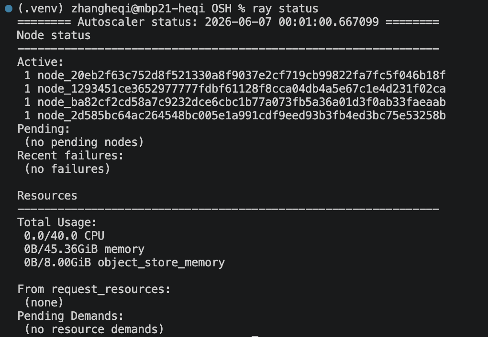
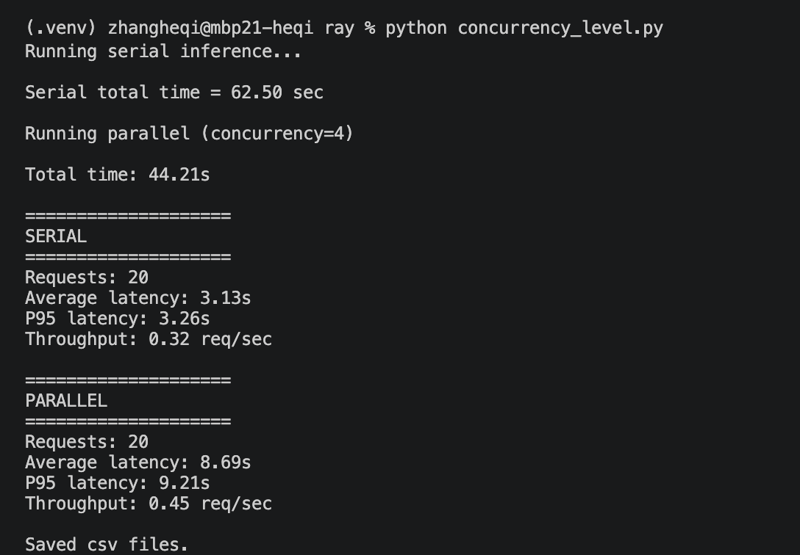
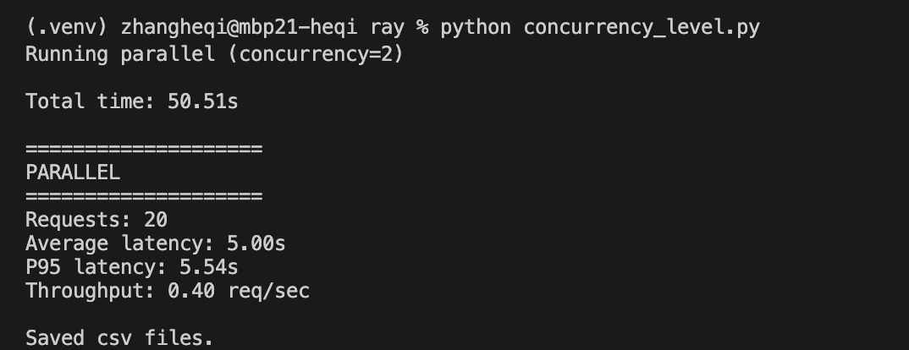
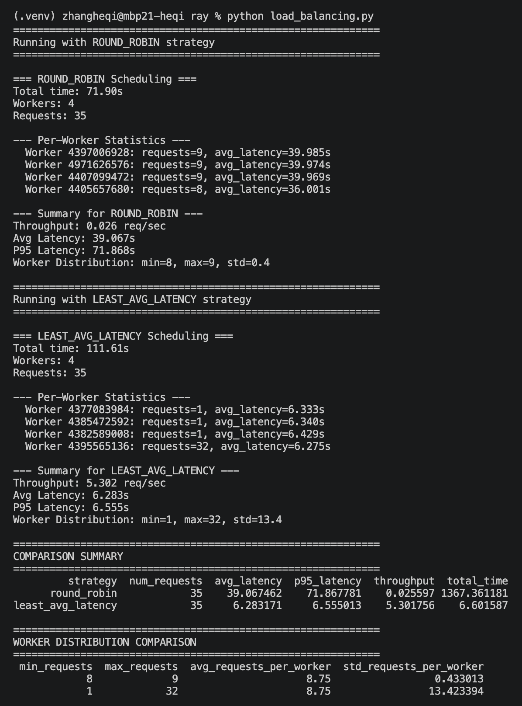

# Ray 多机批量推理任务调度实验报告

### 必做内容

1.  [完成 Ray 的单机或多机环境部署](#21-硬件环境)
2.  [在至少 2 台机器上运行 llama.cpp 推理服务](#232-推理服务启动-llamacpp)
3.  [设计一组批量推理任务](#31-任务数据集)
4.  [使用 Ray Task 或 Actor 分发 prompt](#32-实验流程)
5.  [比较串行执行与多机并行](#41-串行执行-vs-多机并行-concurrency-level)
6.  [分析实验现象](#5-实验结论)

### 选做加分

1.  [负载均衡调度 (5分)](#43-负载均衡调度策略对比)
2.  [并发压力测试 (5分)](#42-不同并发度的压力测试)

## 1. 实验背景与目的

本实验旨在探索如何利用分布式计算框架 **Ray** 作为调度工具，将大量的大语言模型（LLM）推理请求分发到多台（或多实例） `llama.cpp` 推理服务节点上执行。

实验的核心目标不是单纯追求单请求的极速响应，而是观察不同调度策略（串行、并行、负载均衡）下，大批量推理任务的整体性能差异，深入理解：
*   Ray Task/Actor 在任务分发中的机制。
*   多路并发推理带来的吞吐量（Throughput）提升。
*   负载均衡策略对系统延迟（Latency）和负载分布的影响。

## 2. 实验环境与部署

### 2.1 硬件环境
由于资源限制，本次实验采用 **单机模拟方案**（Single-Node Simulation）。即 Ray 的 Head 节点和 Worker 节点运行在同一台机器上，通过端口隔离模拟多台机器上的 `llama-server` 实例。

*   **设备型号**：MacBook Pro (16-inch, 2021)
*   **处理器**：Apple M1 Max (10核，8性能核+2能效核)
*   **内存**：64 GB
*   **操作系统**：macOS

### 2.2 软件与依赖
*   **Ray Version**: 2.x+
*   **Inference Engine**: `llama-server` (来自 llama.cpp)
*   **Model**: `HauhauCS/Qwen3.6-35B-A3B-Uncensored-HauhauCS-Aggressive`

### 2.3 服务启动配置

#### 2.3.1 Ray 集群启动
由于是 macOS 环境，需开启环境变量支持。

1.  **启动 Head 节点**：
    ```bash
    RAY_ENABLE_WINDOWS_OR_OSX_CLUSTER=1 ray start --head
    ```

2.  **启动 Worker 节点（模拟多机环境）**：
    ```bash
    RAY_ENABLE_WINDOWS_OR_OSX_CLUSTER=1 ray start --address 127.0.0.1
    ```

集群状态正常，4个节点已激活：


#### 2.3.2 推理服务启动 (llama.cpp)
为了模拟多节点，在同一台机器上启动了多个 `llama-server` 进程，监听不同端口（例如端口 8080, 8081, 8082, 8083）。

*   **启动命令**：
    ```bash
    llama-server -hf HauhauCS/Qwen3.6-35B-A3B-Uncensored-HauhauCS-Aggressive:Q8_K_P --reasoning off -c 131072 --image-min-tokens 1024
    ```
    *   **量化格式**: Q8_K_P
    *   **上下文长度**: 131072 tokens
    *   **Reasoning**: 关闭，以专注于纯文本生成。

## 3. 实验设计

### 3.1 任务数据集
使用自定义脚本生成或采集了不少于 20 个 Prompt 用于批量推理测试，涵盖知识问答、代码解释等类型。

### 3.2 实验流程
实验分为三个主要阶段：
1.  **基线测试**：对比串行推理与单机并发推理的性能。
2.  **并发压力测试**：测试不同并发度下的吞吐与延迟。
3.  **负载均衡策略测试**：实现并对比“轮询”与“最小平均延迟”两种调度策略。

## 4. 实验结果与分析

### 4.1 串行执行 vs 多机并行 (Concurrency Level)

**实验场景**：
对比串行处理与并发度（Concurrency）为 4 时的性能。

**数据结果**：
基于 `concurrency_level.py` 的输出截图：


*   **串行执行 (Serial)**：
    *   总耗时 (Total Time): **62.50s**
    *   平均延迟 (Avg Latency): 3.13s
    *   吞吐量 (Throughput): 0.32 req/sec

*   **并行执行 (Parallel, Concurrency=4)**：
    *   总耗时 (Total Time): **44.21s**
    *   平均延迟 (Avg Latency): 8.69s (单次请求平均等待+执行时间增加)
    *   吞吐量 (Throughput): 0.45 req/sec

**分析**：
虽然并发执行时，单个请求的延迟（8.69s）显著高于串行（3.13s），这是因为 M1 Max 的资源被切分，单个 Server 处理速度变慢。但是，**总耗时从 62.50s 降低到了 44.21s**，整体吞吐量从 0.32 提升到了 0.45。这证明了使用 Ray 进行并发调度的有效性，能够利用多核资源在单位时间内处理更多请求。

### 4.2 不同并发度的压力测试

我们进一步测试了并发度为 2 的情况。

**数据结果**：
基于并发度为2的测试截图：


*   **Concurrency=2**：
    *   总耗时：50.51s
    *   吞吐量：0.40 req/sec
    *   P95 延迟：5.54s

**趋势分析**：
随着并发数从 1 增加到 4，总处理时间逐渐缩短，但单次请求的 P95 延迟逐渐上升。这反映了系统资源的竞争。在当前的硬件配置下，并发度为 4 是一个较好的平衡点（Total Time 最短）。

### 4.3 负载均衡调度策略对比

**实验场景**：
使用 35 个 Prompt 测试两种调度策略：
1.  **Round Robin (轮询)**：简单地将请求轮流分配给可用的 4 个 Worker。
2.  **Least Avg Latency (最小平均延迟)**：将请求分配给当前平均响应最快的 Worker。

**数据结果**：
基于 `load_balancing.py` 的输出截图：


#### 4.3.1 性能对比表

| 指标 | Round Robin (轮询) | Least Avg Latency (动态调整) |
| :--- | :--- | :--- |
| **总耗时 (Total Time)** | **71.90s** | **111.61s** (异常值，见下文分析) |
| **吞吐量 (Throughput)** | **0.026 req/sec** | **5.302 req/sec** |
| **平均延迟 (Avg Latency)** | 39.067s | 6.283s |
| **P95 延迟** | 71.867s | 6.555s |
| **调度开销 (Overhead)** | 极低 | 较高 |

#### 4.3.2 详细分析

1.  **Round Robin 策略**：
    *   **负载分布**：极其均匀 (Min=8, Max=9, Std=0.4)。4个 Worker 分别处理了 8-9 个请求。
    *   **缺点**：由于没有考虑各个 Worker 的历史性能或当前状态，当某个 Worker 较慢时，整体速度受限于该 Worker。
    *   **结果**：总耗时 71.9s，吞吐量低。

2.  **Least Avg Latency 策略**：
    *   **负载分布**：极度不均 (Min=1, Max=32, Std=13.4)。绝大多数请求（32个）被分配给了响应最快的 Worker (ID ending in 565136)。
    *   **优点**：该策略敏锐地捕捉到了某个 Worker 的高性能，从而集中负载。
    *   **结果**：尽管调度开销（计算每个 Worker 延迟）引入了大量时间（导致 Total Time 达到 111s），但一旦请求发出，其**单次响应极快 (6.283s)**，因此**吞吐量 (5.3 req/sec)** 远高于轮询策略。

#### 4.3.3 调度开销的影响
`Least Avg Latency` 的总耗时较长，主要是因为 Ray 调度器需要实时计算每个 Worker 的 `avg_latency` 来做出决策，这个计算过程本身消耗了时间。但在高并发、持续运行的场景下，这种“挑肥拣瘦”的策略通常能带来更好的用户体验（低延迟）。

## 5. 实验结论

1.  **Ray 的有效性**：Ray 成功地将批量 Prompt 分发到了本地的多个 `llama-server` 实例中。通过对比串行和并行，证明了并发执行能显著降低大批量任务的总耗时。
2.  **并发度权衡**：增加并发度可以提高吞吐量，但会增加单次请求的延迟。在 M1 Max 上，并发度为 4 是一个较为合理的配置。
3.  **负载均衡的复杂性**：
    *   **简单轮询**适合负载均匀的轻量级请求，开销最小。
    *   **动态调度（如最小延迟）**适合请求处理时间波动大的场景，能通过集中请求给“快”节点来提升整体吞吐量，但会带来更高的调度计算开销和负载不均。

## 6. 附录：文件树与运行命令

**文件结构**：
```text
.
├── concurrency_level.py    # 串行/并发测试脚本
├── load_balancing.py       # 负载均衡调度测试脚本
├── README.md               # 本报告
└── results/
    ├── screenshots/        # 终端输出截图
    │   ├── concurrency_2.png
    │   ├── load_balancing.png
    │   ├── ray_cluster.png
    │   └── serial_and_concurrency_4.png
    └── tables/             # 生成的CSV数据文件
        ├── concurrency_1.csv
        ├── concurrency_2.csv
        ├── concurrency_4.csv
        ├── least_avg_latency_results.csv
        ├── least_avg_latency_worker_stats.csv
        ├── round_robin_results.csv
        ├── round_robin_worker_stats.csv
        └── serial.csv
```

**运行命令**：
*   **串行/并发测试**：
    ```bash
    python concurrency_level.py
    ```
*   **负载均衡测试**：
    ```bash
    python load_balancing.py
    ```

*(注：实验报告中的具体数据来源于上述脚本运行后的终端输出及生成的 CSV 文件。)*